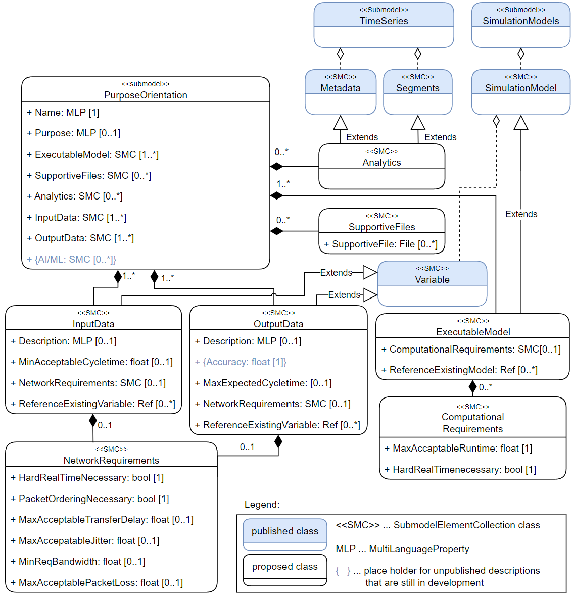

# Semester Thesis / AASPurposeOrientation

This repository contains the written PDF version of my semester thesis with the Institute of Automation and Information Systems at the Technical University of Munich (TUM) and the Barton Research Group at the University of Michigan. Additionally, the accompanying AASX template model that represents the core technical contribution of this work is uploaded here.

The thesis is titled:

**Sharing of Digital Twins for Manufacturing and their Associated Requirements for Integration and Aggregation Along the Value Chain**

Please note that this repository does not necessarily represent the exact final version that was officially submitted and graded.

## Overview

This thesis investigates how Digital Twins (DTs) can be shared more effectively along the manufacturing value chain.  
As a central contribution, it proposes a standardized structure based on the **Asset Administration Shell (AAS)** to describe and exchange essential Digital Twin information in a structured and reusable way.

## AASX Model

The included AASX file contains the proposed AAS Submodel template **`PurposeOrientation`**.

In simplified terms, this model is intended to support the sharing of Digital Twins by providing a structured way to describe:

- essential Digital Twin information,
- input and output data requirements,
- relevant network requirements,
- and computational requirements for integration and aggregation.

The model was implemented in the **AASX Package Explorer V3.0** using version **v2024-06-10** and is intended as a research-oriented prototype and template for further work.

### Figure 3.4

*Figure 3.4: UML Diagram of the proposed standardized Submodel depicting its elements
and referenced existing Submodels.*

## Contents

- `Semester Thesis.pdf` – written thesis document
- `PurposeOrientation_Template.aasx` – AASX implementation of the proposed AAS submodel template

## Note

The included AASX model reflects the concept developed and implemented in the context of this thesis. It is provided for documentation and demonstration purposes.
